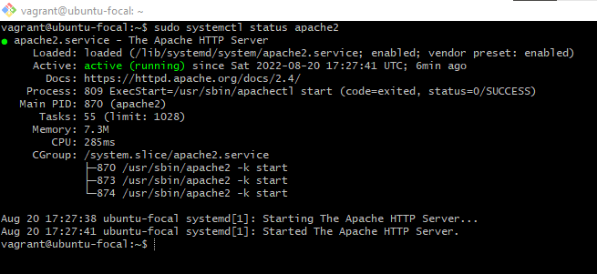
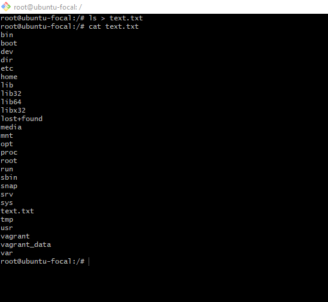
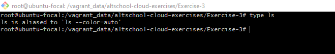
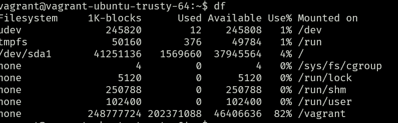
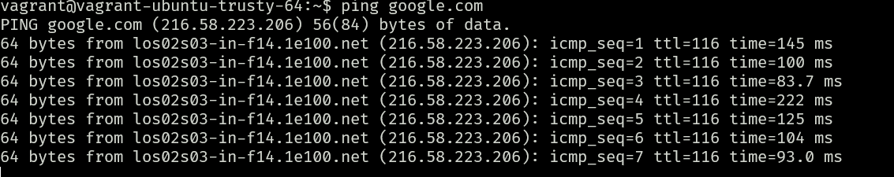
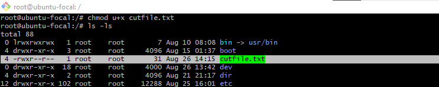
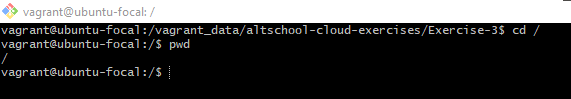
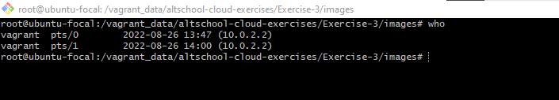
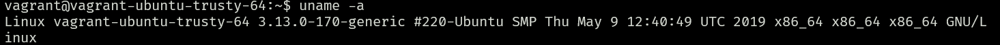
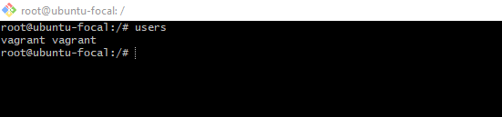

## **10 LINUX COMMAND**

# What is a Linux command?

Linux is a family of open-source Unix-like operating systems based on the Linux kernel. The Linux command is a utility of the Linux operating system. All basic and advanced tasks can be done by executing commands. The commands are executed on the Linux terminal. The terminal is a command-line interface to interact with the system, which is similar to the command prompt in the Windows OS. Commands in Linux are case-sensitive.

## Linux system management Command

1. systemctl Command

The systemctl command is a utility which is responsible for examining and controlling the systemd system and service manager. It is a collection of system management libraries, utilities and daemons which function as a successor to the System V init daemon. The new systemctl commands have proven quite useful in managing a servers services

_syntax_

$ systemctl status apache2

_output_

## Linux I/O Redirection

2. < > Command

Redirection can be defined as changing the way from where commands read input to where commands sends output. You can redirect input and output of a command.
For redirection, meta characters are used. Redirection can be into a file (shell meta characters are angle brackets '<', '>') or a program ( shell meta characters are pipesymbol '|').

_syntax_

$ ls > text.txt

_output_

## Linux Shell Commands

3. type Command

Linux 'type' command tell us whether a command given to the shell is a built-in or external command.

_syntax_

$ type ls

_output_

## Basic Unix Tools

4. df Command

Use the df command to report the system’s disk space usage, shown in percentage and kilobyte (KB). Here’s the general syntax:

_syntax_

$ df [options] [file]

_output_

## Linux Filters

5. Ping Command

The ping command is one of the most used basic Linux commands for checking whether a network or a server is reachable. In addition, it is used to troubleshoot various connectivity issues.

_syntax_

$ ping [option] [hostname_or_IP_address]

_output_

## Linux File Ownership

6. chmod Command

Command chown is used to change the owner of the file.

_syntax_

$ chmod u+x file-1

_output_

## Linux Filesystem Hierarchy Standard (FHS)

7. The Root Directory Command

All the directories in the Linux system comes under the root directory which is represented by a forward slash (/). Everything in your system can be found under this root directory even if they are stored in different virtual or physical devices.

_syntax_

$ cd /

_output_

## Linux System Admin Command

8. who Command

Same as w but doesn't show current process

_syntax_

$ whoami

_output_

9. uname Command

The uname or unix name command will print detailed information about your Linux system and hardware. This includes the machine name, operating system, and kernel. To run this command, simply enter uname into your CLI.

_syntax_

$ uname [option]

_output_

10. users Command

Show current logged in users

_syntax_

$ users

_output_

## THE END
